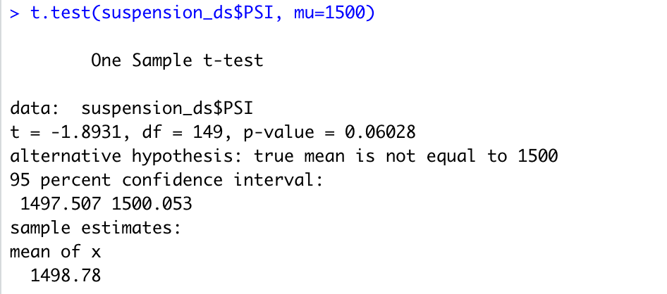

# MechaCar_Statistical_Analysis

## Linear Regression to Predict MPG 

### 1. Which variables/coefficients provided a non-random amount of variance to the mpg values in the dataset?
- Looking at the P values, we can see that **vehicle_length** (2.60e-12) and **ground_clearance** (5.21e-08) are the two variables that provided a non-random amount of variances to the mpg value.

### 2. Is the slope of the linear model considered to be zero? Why or why not?
- The P-value of this multiple linear regression is 5.35e-11, and it is less than 0.05. As a result, we can **reject the null Hypothesis** that the slope of the linear model is considered to be zero.

### 3. Does this linear model predict mpg of MechaCar prototypes effectively? Why or why not?
- Since the R-squared value of this model is 0.7149, meaning its prediction ability is correct around 71%, so we can say this **linear model predicts mpg effectively**. 

## Create Visualizations for the Trip Analysis
### The design specifications for the MechaCar suspension coils dictate that the variance of the suspension coils must not exceed 100 pounds per square inch. Does the current manufacturing data meet this design specification for all manufacturing lots in total and each lot individually? Why or why not?
- When looking at the summary table, we can see the variance of all the manufacturing lots are lower than 100 pounds per square inch (62.3 to be exact). 

- However, when looking at each manufacturing lot individually, we can see **lot 3's variance** is 70 pounds per square inch **higher** than the requirement; only **lot 1 and lot 2** do **meet the requirement**(0.98 and 7.47, respectively)

## T-Tests on Suspension Coils
### Determine if all manufacturing lots and each lot individually are statistically different from the population mean of 1,500 pounds per square inch.
- The t-test that compares the PSI from all of the three lots has a p-value of 0.06028, which is slightly higher than a standard 0.05. It confirms that we can **reject the null Hypothesis**, and the mean PSI of the three lots **is not statistically different** than the population mean of 1500 pounds per square inch.

- When reviewing the t-test for individual lots, we can see that only **lot 3 is statistically different** from the population mean because it has a p-value of 0.042. On the other hand, **lot 1 and lot 2 are not statistically different** from the population mean since their p-value is at 1 and 0.6072.

